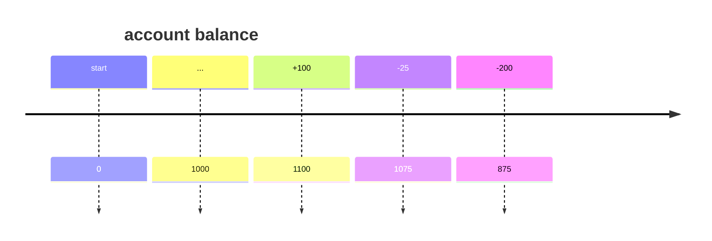

## Terms
- **account** – accumulator (~bag/container)
	- starts empty
	- **balance** – number of units in the bag at the particular moment in time
		- can be negative
	- **posting** – changing the state of the account
	- types:
		- **balance** – sum of all at a particular moment in time (e.g. checking account)
			- balance sheet accounts
		- **delta** – company's expenses; summed to quarters, months etc.
			- income statement accounts
- **debit**
	- in asset accounts "removed from your account"
		- withdrawal
		- assets = positive balance
		- liabilities = negative balance
- **credit**
	- in asset accounts "deposited in your account"
		- deposit
		- expenses = positive balance
- **normal sign**
	- most accounts will keep the same sign

### Account types

| Type / Balance                                | Positive (+) | Negative (-) |
| --------------------------------------------- | ------------ | ------------ |
| *Balance sheet* (at a point in time)       | Assets       | Liabilities  |
| *Income statement* (over a period of time) | Expenses     | Income       |
- **assets** – something you _have_ e.g. checking account
- **liabilities** – something you _owe_ e.g. a loan
- **expenses** – something you _received_ e.g. travel
- **income** – something _given away_ to receive something e.g. dividends from investments

## Statements
### Timeline

### Table
* balance is always including the transaction from the same row (_after_ the transaction)
#### Single amount column

| Date              | Description | Amount  | Balance |
| ----------------- | ----------- | ------- | ------- |
| 2023/01/01        | [...]       | 100.00  | 1100.00 |
| 2023/01/02        | [...]       | -25.00  | 1075.00 |
| 2023/01/03        | [...]       | -200.00 | 875.00  |
| **Final balance** |             |         | 875.00  |
#### Split column
| Date              | Description | Debit  | Credit | Balance |
| ----------------- | ----------- | ------ | ------ | ------- |
| 2023/01/01        | [...]       |        | 100.00 | 1100.00 |
| 2023/01/02        | [...]       | 25.00  |        | 1075.00 |
| 2023/01/03        | [...]       | 200.00 |        | 875.00  |
| **Final balance** |             |        |        | 875.00  |

# Sources
